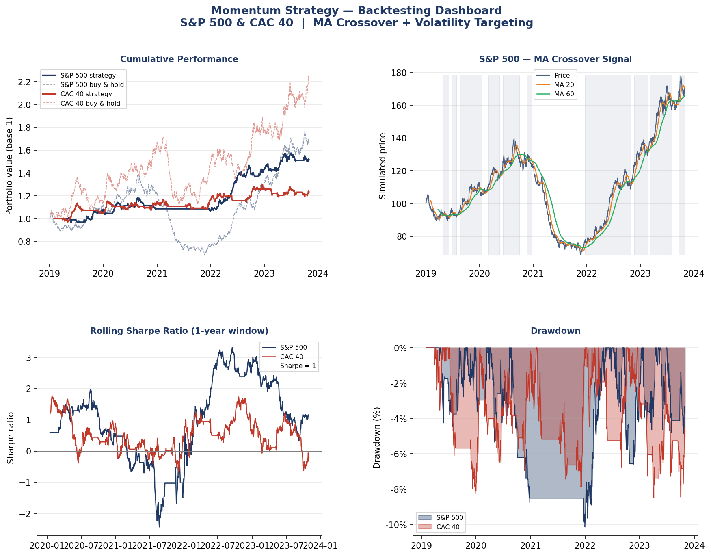

# momentum-backtest

Backtest of a momentum strategy on S&P 500 and CAC 40, built as a personal project to explore quantitative finance concepts I've been studying alongside my degree.

The strategy is simple on purpose. I wanted to understand each part properly before adding complexity.

## How it works

Signal: dual moving average crossover (MA 20 / MA 60). Long when the short MA is above the long MA, flat otherwise.

Position sizing: volatility targeting. The position is scaled so the strategy targets ~10% annual vol, which reduces exposure automatically when markets get turbulent.

Transaction costs: 5 bps per trade, applied on every position change.

The signal is shifted by one day before computing returns to avoid lookahead bias.

## Results

Backtest on 5 years of simulated data (GBM with a crisis period injected around year 2.5).

```
                           S&P 500     CAC 40
------------------------------------------------
ann return                    8.7%       4.3%
ann vol                       8.2%       8.5%
sharpe                        1.06       0.51
max drawdown                -10.1%      -8.5%
bench sharpe                  0.63       0.83
```

The S&P 500 result is decent. Sharpe above 1, drawdown contained. CAC 40 is weaker, which makes sense since momentum tends to work better on trending markets. The win rate is ~31% on both, which is expected for a trend-following strategy: few big wins, many small losses.



## Run it

```bash
pip install -r requirements.txt
python strategy.py
```

No external data API needed. Prices are generated internally for reproducibility.

## What I'd add next

- pull real index data via yfinance instead of simulated prices
- try RSI as a second filter to reduce false signals
- test different MA window pairs to see how sensitive the results are
- proper walk-forward validation instead of a single in-sample backtest

## Stack

Python, pandas, numpy, matplotlib.

Built by Haroun, bachelor business engineering, UCLouvain Saint-Louis Brussels.
